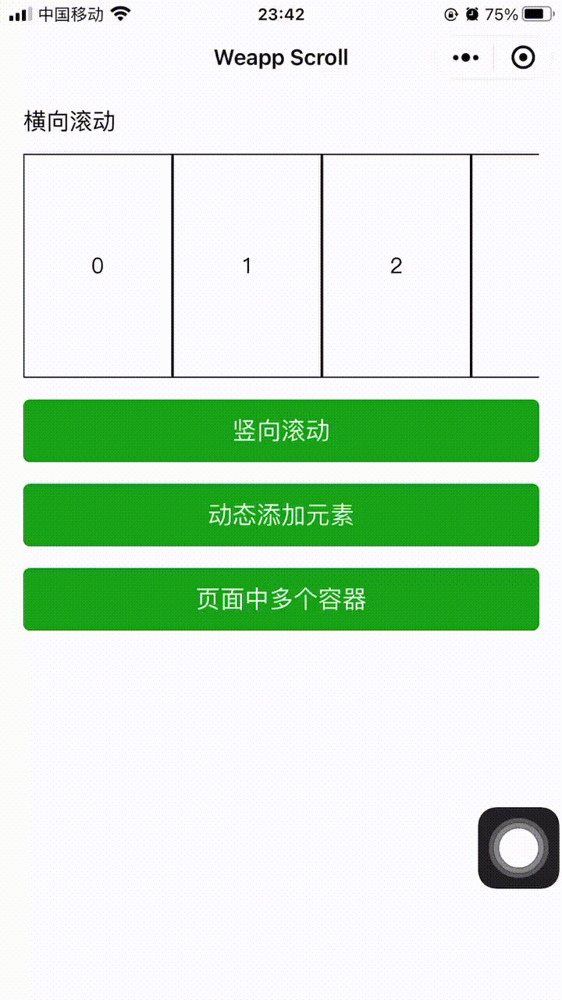

# Weapp Scroll
Weapp Scroll 是基于 [WXS](https://developers.weixin.qq.com/miniprogram/dev/reference/wxs/01wxs-module.html) 实现的平滑滚动容器，有一些计算的逻辑参考了 [better-scroll](https://github.com/ustbhuangyi/better-scroll)。

在微信小程序中，使用 WXS 相对于逻辑层来处理交互事件拥有较好的性能，相关官方文档：[WXS响应事件](https://developers.weixin.qq.com/miniprogram/dev/framework/view/interactive-animation.html)。

滚动原理参考 [滚动原理](https://better-scroll.github.io/docs/zh-CN/guide/#%E6%BB%9A%E5%8A%A8%E5%8E%9F%E7%90%86)。

[微信小程序中基于WXS实现回弹的平滑滚动容器](https://juejin.cn/post/7119278260315242503)

## 效果预览


## 使用
1. 拷贝 `dist/index.wxs` 文件至项目中并重命名为 `weapp-scroll.wxs`
2. 在需要使用的页面或组件使用 `<wxs></wxs>` 标签引入 `weapp-scroll.wxs`

下面是创建横向滚动的简单的示例：

```html
<!-- 注意修改实际的文件路径 -->
<wxs src="./weapp-scroll.wxs" module="weappScroll"></wxs>

<view 
  style="width: 100vw;"
  change:_="{{ weappScroll.setup }}"
  _="{{ { slidingContainerSelector: '.content' } }}"
  bind:touchstart="{{ weappScroll.touchstart }}"
  bind:touchmove="{{ weappScroll.touchmove }}"
  bind:touchend="{{ weappScroll.touchend }}"
  bind:touchcancel="{{ weappScroll.touchend }}"
>
  <view class="content" style="display: inline-block; white-space: nowrap;">
    <view wx:for="{{ 10 }}" wx:key="index" style="width: 200rpx; height: 300rpx; border: 1px solid; display: inline-block;">{{ item }}</view>
  </view>
</view>
```

## 示例
项目中 example 目录是一个小程序项目，里面包含了一些使用示例

+ `example/pages/index`，横向滚动
+ `example/pages/vertical`，竖向滚动
+ `example/pages/dynamic`，容器子元素动态变化
+ `example/pages/multiple`，同一页面使用多次

## 选项

| 属性                     | 默认值                                            | 描述                                                         |
| ------------------------ | ------------------------------------------------- | ------------------------------------------------------------ |
| enableScrollX            | 滑动容器的宽度大于容器的宽度时为 true，否则 false | 是否启用横向的滚动                                           |
| enableScrollY            | 滑动容器的高度大于容器的高度时为 true，否则 false | 是否启用竖向的滚动                                           |
| slidingContainerSelector | .content                                          | 滑动容器的选择器                                             |
| damping                  | 0.3                                               | 滑动超出边界后，超出边界的阻尼系数，取值在 [0, 1]，值约小，阻力越大 |
| bounceDuration           | 800                                               | 滑动超出边界后进行反弹，设置反弹动画的持续时间               |

## 事件
### onScroll
在滑动容器滑动时触发
```ts
interface ScrollCallback {
  (data: {
    // 滑动容器的 translateX
    x: number
    // 滑动容器的 translateY
    y: number
    // 滑动容器在 X 方向的最大滑动距离，正值
    maxScrollDistanceX: number
    // 滑动容器在 Y 方向的最大滑动距离，正值
    maxScrollDistanceY: number
  }): void
}

function onScroll(callback: ScrollCallback): () => void
```

示例
```js
// 在页面中任意引入到的 *.wxs 文件
var weappScroll = require('./weapp-scroll.wxs')

var cancel = weappScroll.onScroll(function (data) {
  console.log(data.x)
})

// 取消监听
cancel()
```

## License

[MIT](https://github.com/haiya6/weapp-scroll/blob/main/LICENSE)
